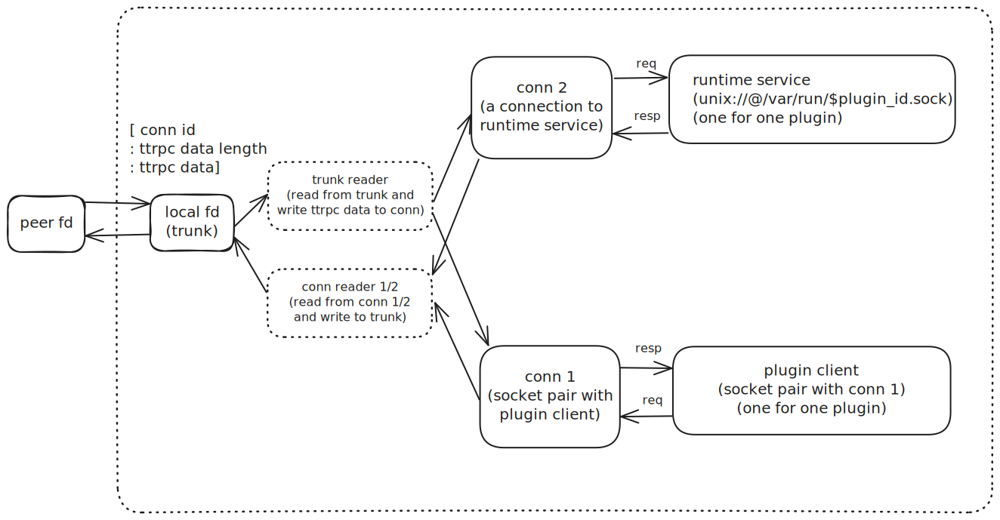

# iSulad NRI Rust 扩展实现

## 简介

此模块用于扩展 iSulad 对于 NRI 插件的支持。
C/C++ 未提供对于 ttrpc 的支持，因此在这里通过 Rust 扩展 iSulad 与 NRI 插件进行 ttrpc 通信的支持。

## 对外接口

nri_plugin.h 中定义了一系列对 C/C++ 暴露的接口调用，具体包括如下内容：

```C
// 注册 iSulad 对于 runtime 服务 register_plugin 和 update_containers 的回调
int nri_runtime_service_init(nri_runtime_callbacks callbacks);

// 关闭所有插件服务
void nri_runtime_service_destroy();

// 启动 external service，创建一个 named socket 用于外部插件连接，注册外部插件连接时的回调
int nri_external_service_start(const char *socket_addr,
                               nri_external_connect_callback callback);

// 关闭 external service
void nri_external_service_shutdown();

// 用于与插件之间的连接，plugin_id 标识唯一的插件，fd 为与插件通信的描述符，timeout 定义超时时间
int nri_plugin_connect(const char *plugin_id, int fd, int64_t timeout);

// 断开与对应插件的连接
int nri_plugin_disconnect(const char *plugin_id);

// 插件服务客户端请求：configure
int nri_plugin_configure(const char *plugin_id,
                         const nri_configure_request *request,
                         nri_configure_response **response);

// 插件服务客户端请求：synchronize
int nri_plugin_synchronize(const char *plugin_id,
                           const nri_synchronize_request *request,
                           nri_synchronize_response **response);

// 插件服务客户端请求：shutdown
int nri_plugin_shutdown(const char *plugin_id);

// 插件服务客户端请求：create container
int nri_plugin_create_container(const char *plugin_id,
                                const nri_create_container_request *request,
                                nri_create_container_response **response);

// 插件服务客户端请求：update container
int nri_plugin_update_container(const char *plugin_id,
                                const nri_update_container_request *request,
                                nri_update_container_response **response);

// 插件服务客户端请求：stop container
int nri_plugin_stop_container(const char *plugin_id,
                              const nri_stop_container_request *request,
                              nri_stop_container_response **response);

// 插件服务客户端请求：state change
int nri_plugin_state_change(const char *plugin_id,
                            const nri_state_change_event *event);
```

## 详细设计

isula-rust-extensions 中 NRI 相关逻辑完成 iSulad 与 NRI 插件之间的 ttprc 通信。NRI 插件在与容器引擎进行通信时，需要一对 fd: (local fd, peer fd) 分别作为通信的两端，根据 NRI 插件的两种类型，fd 来源也有两种：
 - 由容器引擎自行拉起的插件，iSulad 拉起插件时会创建一对socket，分别用于 local fd 和 peer fd；
 - 外部插件，iSulad 会拉起 external 服务，并创建一个 external 连接监听，外部插件创建时尝试连接 external 服务，连接的两端分别作为 local fd 和 peer fd。

在 containerd 社区的 [NRI](https://github.com/containerd/nri) 模块设计中，NRI 插件与容器引擎之间的 ttrpc 通信采用了一种多路复用的方式，这种多路复用的方式对生成的 ttrpc 数据进行了一层封装，其格式如下：
 - 4字节的 conn id；
 - 4字节的 ttrpc 数据长度；
 - 对应数据长度的 ttrpc 数据。

容器引擎与 NRI 插件之间通信信息为以上封装后的数据，为适应于 containerd 社区的 NRI 插件，本模块采用了类似的多路复用实现。

如图所示，在实现中，每一个 NRI 插件与容器引擎总是存在一对 fd：(peer fd, local fd)，用于相互之间的通信。local fd 被容器引擎侧所使用，每一个插件存在一个 trunk reader 线程不断读取 local fd，将 ttrpc 数据写入对应的连接中；对于多路复用的每一个连接则存在一个 conn reader 线程不断读取来自不同连接的数据，并将其写入 local fd 中。

对于每一个 NRI 插件，多路复用所用到的连接有两个：
 - 如图所示 conn 1 和 plugin client 为新创建的 socket 对，plugin client 处理来自于 iSulad 的请求，将其封装为 ttrpc 请求数据，conn 1 所对应的conn reader线程会不断将该数据封装写入至 local fd；
 - conn 2 则对应 iSulad 作为服务端时的连接，为区分不同插件的请求，iSulad 初始化时创建了一个以插件 id 命名的ttrpc服务，conn 2 对应该服务的一个连接，conn 2对应的 conn reader 线程则会不断将 iSulad 返回的服务响应封装写入至 local fd。




